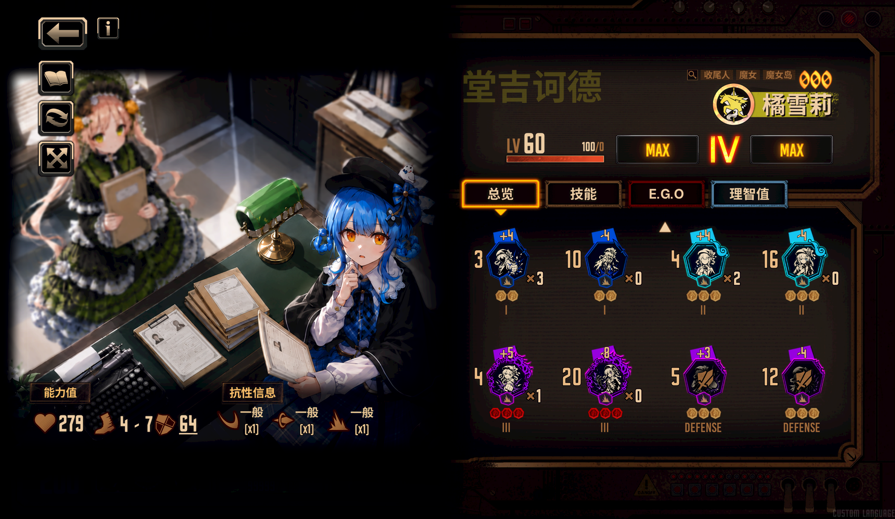
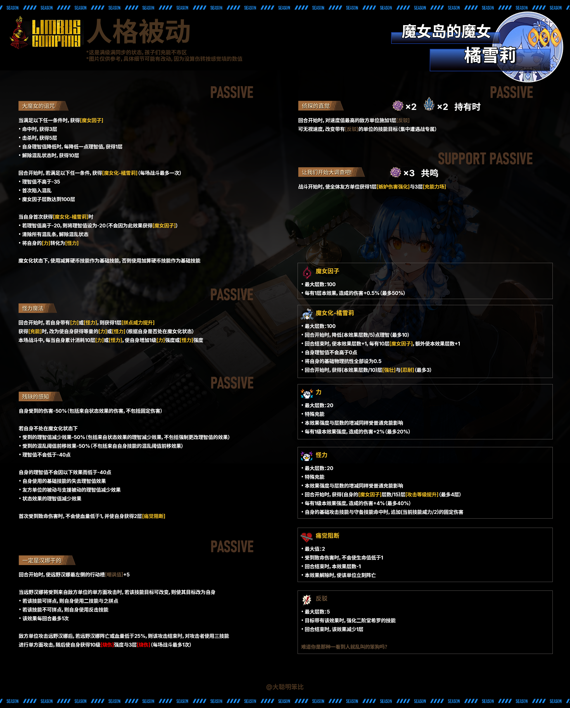
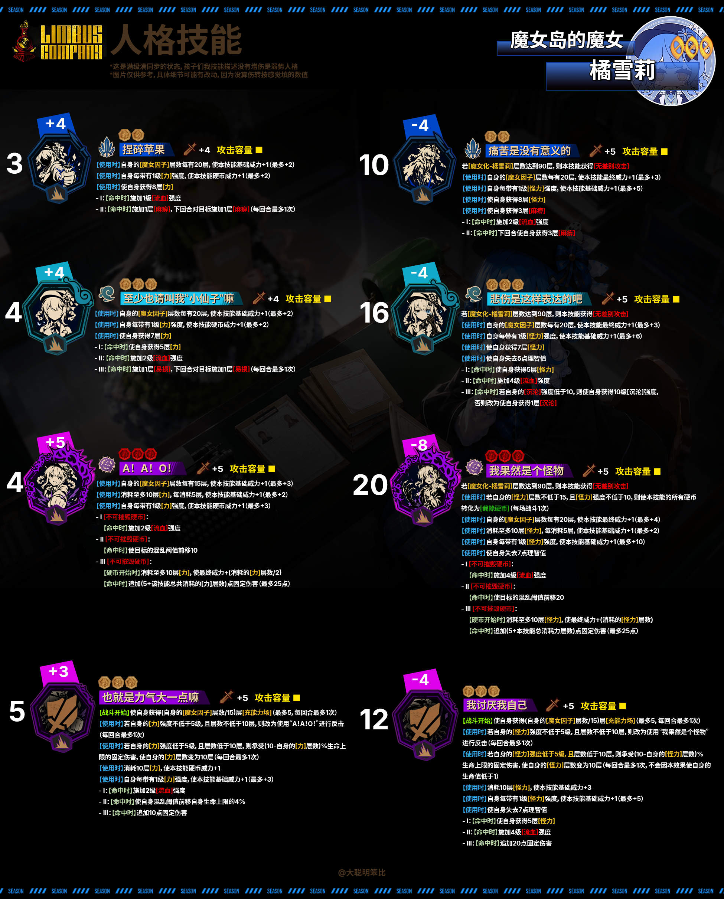

# 橘雪莉人格mod



## 安装

1. 从本仓库的 Releases 下载 ZIP
2. 将其中的 `TachibanaSherry-Identity` 文件夹放到 `./LetheLauncher-Distribution-7/BepInEx/plugins/Lethe/mods`
3. 将其中的 `TachibanaSherry.dll` 放到 `./LetheLauncher-Distribution-7/BepInEx/plugins/`

安装后目录结构应为：

```text
./LetheLauncher-Distribution-7/BepInEx/plugins/
├── TachibanaSherry.dll
└── Lethe/
    └── mods/
        └── TachibanaSherry-Identity/
            ├── custom_appearance/
            ├── custom_buffs/
            ├── custom_limbus_data/
            ├── custom_limbus_locale/
            ├── custom_sounds/
            ├── custom_sprites/
            ├── custom_unit_keywords/
            └── modular_lua/
```

## 人格介绍

> 所属罪人：堂吉诃德

### 基础面板

- 基础体力：87，成长系数：3.2
- 防御补正：+4
- 混乱阈值：30%
- 速度：4～7
- 物理抗性：斩击×1 突刺×1 打击×1
- 标签：魔女岛、魔女、收尾人

### 饼图




### 技能

#### 常态

**捏碎苹果 【傲慢/打击/+4/■】**  
3+4+4  
【使用时】 自身的[魔女因子]每有20层，使本技能基础威力+1（最多+2）  
【使用时】 自身每带有1级[力]强度，使本技能硬币威力+1（最多+2）  
【使用时】 使自身获得8层[力]  

- I：【命中时】 施加1级[流血]强度
- II：【命中时】 施加1层[麻痹]，下回合对目标施加1层[麻痹]（每回合最多1次）

**至少也请叫我“小仙子”嘛 【忧郁/打击/+4/■】**  
4+4+4+4  
【使用时】 自身的[魔女因子]每有20层，使本技能基础威力+1（最多+2）  
【使用时】 自身每带有1级[力]强度，使本技能硬币威力+1（最多+2）  
【使用时】 使自身获得7层[力]  

- I：【命中时】 使自身获得5层[力]
- II：【命中时】 施加2级[流血]强度
- III：【命中时】 施加1层[易损]，下回合对目标施加1层[易损]（每回合最多1次）

**A！A！O！ 【嫉妒/打击/+5/■】**  
4+5+5+5  
【使用时】 自身的[魔女因子]每有15层，使本技能基础威力+1（最多+3）  
【使用时】 消耗至多10层[力]；每消耗5层，使本技能基础威力+1（最多+2）  
【使用时】 自身每带有1级[力]强度，使本技能硬币威力+1（最多+3）  

- I：【不可摧毁硬币】【命中时】 施加2级[流血]强度
- II：【不可摧毁硬币】【命中时】 使目标的混乱阈值前移10
- III：【不可摧毁硬币】【硬币开始时】 消耗至多10层[力]，使最终威力+（消耗的[力]层数/2）；【命中时】 追加（5+本技能总共消耗的[力]层数）点固定伤害（最多25点）

**守备技能：也就是力气大一点嘛 【嫉妒/打击/+5/■】**  
5+3+3+3  
【战斗开始时】 使自身获得（自身的[魔女因子]层数/15）层[充能力场]（最多5层，每回合最多1次）  
【使用时】 若自身的[力]强度不低于5级，且层数不低于10层，则改为使用“A！A！O！”进行反击（每回合最多1次）  
【使用时】 若自身的[力]强度低于5级，且层数低于10层，则承受（10-自身的[力]层数）%生命上限的固定伤害，并使自身的[力]层数变为10层（每回合最多1次）  
【使用时】 消耗10层[力]，使本技能硬币威力+1  
【使用时】 自身每带有1级[力]强度，使本技能基础威力+1（最多+3）  

- I：【命中时】 施加2级[流血]强度
- II：【命中时】 使自身混乱阈值前移自身生命上限的4%
- III：【命中时】 追加10点固定伤害

#### 魔女化

**痛苦是没有意义的 【傲慢/打击/+5/■】**  
10-4-4  
[魔女化-橘雪莉]减算硬币技能  
[魔女化-橘雪莉]达到90层时，本技能获得[无差别攻击]  
【使用时】 自身的[魔女因子]每有20层，使本技能最终威力+1（最多+3）  
【使用时】 自身每带有1级[怪力]强度，使本技能基础威力+1（最多+5）  
【使用时】 使自身获得8层[怪力]  
【使用时】 使自身获得3层[麻痹]  

- I：【命中时】 施加2级[流血]强度
- II：【命中时】 下回合使自身获得3层[麻痹]

**悲伤是这样表达的吧 【忧郁/打击/+5/■】**  
16-4-4-4  
[魔女化-橘雪莉]减算硬币技能  
[魔女化-橘雪莉]达到90层时，本技能获得[无差别攻击]  
【使用时】 自身的[魔女因子]每有20层，使本技能最终威力+1（最多+3）  
【使用时】 自身每带有1级[怪力]强度，使本技能基础威力+1（最多+6）  
【使用时】 使自身获得7层[怪力]  
【使用时】 使自身失去5点理智值  

- I：【命中时】 使自身获得5层[怪力]
- II：【命中时】 施加4级[流血]强度
- III：【命中时】 若自身的[沉沦]强度低于10级，则使自身获得10级[沉沦]强度；否则改为使自身获得1层[沉沦]

**我果然是个怪物 【嫉妒/打击/+5/■】**  
20-8-8-8  
[魔女化-橘雪莉]减算硬币技能  
[魔女化-橘雪莉]达到90层时，本技能获得[无差别攻击]  
【使用时】 若自身的[怪力]层数不低于15层，且强度不低于10级，则使本技能的所有硬币转化为[截除硬币]（每场战斗1次）  
【使用时】 自身的[魔女因子]每有20层，使本技能最终威力+1（最多+2）  
【使用时】 消耗至多10层[怪力]；每消耗5层，使本技能基础威力+1（最多+2）  
【使用时】 自身每带有1级[怪力]强度，使本技能基础威力+1（最多+3）  
【使用时】 使自身失去7点理智值  

- I：【不可摧毁硬币】【命中时】 施加4级[流血]强度
- II：【不可摧毁硬币】【命中时】 使目标的混乱阈值前移20
- III：【不可摧毁硬币】【硬币开始时】 消耗至多10层[怪力]，使最终威力+（消耗的[怪力]层数）；【命中时】 追加（5+本技能总共消耗的[怪力]层数）点固定伤害（最多25点）

**守备技能：我讨厌我自己 【嫉妒/打击/+5/■】**  
12-4-4-4  
【战斗开始时】 使自身获得（自身的[魔女因子]层数/15）层[充能力场]（最多5层，每回合最多1次）  
【使用时】 若自身的[怪力]强度不低于5级，且层数不低于10层，则改为使用“我果然是个怪物”进行反击（每回合最多1次）  
【使用时】 若自身的[怪力]强度低于5级，且层数低于10层，则承受（10-自身的[怪力]层数）%生命上限的固定伤害，并使自身的[怪力]层数变为10层（每回合最多1次；不会因本效果使自身的生命值低于1）  
【使用时】 消耗10层[怪力]，使本技能基础威力+3  
【使用时】 自身每带有1级[怪力]强度，使本技能基础威力+1（最多+5）  
【使用时】 使自身失去7点理智值  

- I：【命中时】 使自身获得5层[怪力]
- II：【命中时】 施加4级[流血]强度
- III：【命中时】 追加20点固定伤害

### 被动

**大魔女的诅咒**

- 满足以下任一条件时，获得[魔女因子]：
- 命中时，获得3层
- 击杀时，获得5层
- 自身理智值降低时，每降低1点理智值，获得1层
- 解除混乱状态时，获得10层
- 回合开始时，满足以下任一条件时，获得[魔女化-橘雪莉]（每场战斗最多1次）：
- 理智值不高于-35
- 首次陷入混乱
- [魔女因子]达到100层
- 自身首次获得[魔女化-橘雪莉]时：
- 若理智值高于-20，则将理智值设为-20（不会因本效果获得[魔女因子]）
- 清除所有混乱条，并解除混乱状态
- 将自身的[力]转化为[怪力]
- 魔女化状态下，使用减算硬币技能作为基础技能；否则使用加算硬币技能作为基础技能

**怪力魔法**

- 回合开始时，若自身带有[力]或[怪力]，则获得1层[拼点威力提升]
- 获得[充能]时，改为使自身获得等量的[力]；若处于魔女化状态，则改为获得等量的[怪力]
- 本场战斗中，每当自身累计消耗10层[力]或[怪力]，使自身增加1级对应效果的强度

**残缺的感知**

- 自身受到的伤害-50%（包括来自状态效果的伤害，不包括固定伤害）
- 若自身不处于魔女化状态：
- 受到的理智值减少效果-50%（包括来自状态效果的理智减少效果，不包括强制更改理智值的效果）
- 受到的混乱阈值前移效果-50%（不包括来自自身技能的混乱阈值前移效果）
- 理智值不会低于-40点
- 自身的理智值不会因以下效果而低于-40点：
- 自身使用的基础技能的理智值减少效果
- 友方单位的被动与支援被动的理智值减少效果
- 状态效果的理智值减少效果
- 首次受到致命伤害时，不会使生命值低于1，并使自身获得2层[痛觉阻断]

**一定是汉娜干的**

- 回合开始时，使远野汉娜最左侧的行动槽嘲讽值+5
- 当远野汉娜将受到来自敌方单位的单方面攻击时，若该技能目标可改变，则使其目标改为自身（每回合最多1次）：
- 若该技能可拼点，则自身使用二技能与之拼点
- 若该技能不可拼点，则自身使用反击技能
- 敌方单位攻击远野汉娜后，若远野汉娜阵亡或生命值低于25%，则在该攻击结束时对攻击者使用三技能进行单方面攻击；随后使自身获得10级[烧伤]强度与3层[烧伤]（每场战斗最多1次）

**侦探的直觉 【持有 嫉妒×2、傲慢×2】**

- 回合开始时，对速度值最高的敌方单位施加1层[反驳]
- 可无视速度，改变带有[反驳]的单位的技能目标（集中遭遇战专属）

**支援被动：让我们开始大调查吧!**

- 战斗开始时，使全体友方单位获得1层[嫉妒伤害提升]与3层[充能力场]

### Buff

**魔女因子**

- 最大层数：100
- 每有1层本效果，造成的伤害+0.5%（最多50%）

**魔女化-橘雪莉**

- 最大层数：100
- 回合开始时，降低（本效果层数/5）点理智（最多10点）
- 回合结束时，使本效果层数+1；每有10层魔女因子，额外使本效果层数+1
- 自身理智值不会高于0点
- 将自身的基础物理抗性全部设为0.5
- 回合开始时，获得（本效果层数/10）层强壮与忍耐（最多3层）

**力**

- 最大层数：20
- 特殊充能
- 本效果强度与层数的增减同样受普通充能效果影响
- 每有1级本效果强度，造成的伤害+2%（最多20%）

**怪力**

- 最大层数：20
- 特殊充能
- 本效果强度与层数的增减同样受普通充能效果影响
- 回合开始时，每有15层魔女因子，获得1层攻击等级提升（最多4层）
- 每有1级本效果强度，造成的伤害+4%（最多40%）
- 自身的基础攻击技能与守备技能命中时，追加（当前技能威力/2）的固定伤害

**痛觉阻断**

- 最大层数：2
- 受到致命伤害时，不会使生命值低于1
- 回合结束时，本效果层数-1
- 本效果解除时，使该单位立刻阵亡

**反驳**

- 最大层数：5
- 强化二阶堂希罗对持有者使用的技能；相关被动可无视速度与持有者拼点或改变其技能目标
- 回合结束时，本效果层数-1

## 伤转

> 数据由 gpt 计算得出，仅供参考

### 满加成技能

| 形态 | 技能 | 满加成点数 | 单发伤转 | 固定伤害 |
|---|---|---:|---:|---:|
| 常态 | S1 | 11→17 | ≈54.2 | 0 |
| 常态 | S2 | 12→18→24 | ≈104.5 | 0 |
| 常态 | S3·满资源 | 17→25→38 | ≈183.7 | 25 |
| 常态 | 反击·普通反击 | 12→16→20 | ≈105.2 | 10 |
| 常态 | S3·反击转换（10力起手） | 17→25→33 | ≈163.8 | 15 |
| 魔女化 | S1 | 21→21 | ≈121.9 | 21 |
| 魔女化 | S2 | 28→28→28 | ≈243.8 | 42 |
| 魔女化 | S3·满资源 | **39→39→49** | **≈393.7** | **≈88.5** |
| 魔女化 | 反击·普通反击 | 20→20→20 | ≈194.2 | 50 |
| 魔女化 | S3·反击转换（10怪力起手） | **39→39→39** | **≈354.6** | **≈73.5** |

### 单槽成型伤转

| 形态 | 成型打法 | 6行动总伤转 | 固定伤害 |
|---|---|---:|---:|
| 常态 | 正常技能循环（3S1+2S2+1S3） | ≈555 | 25 |
| 常态 | 持续使用普通反击 | ≈631 | 60 |
| 常态 | 反击转换优化循环（反击替代S1） | **≈820** | **≈64** |
| 魔女化 | 正常技能循环（3S1+2S2+1S3） | **≈1247** | **≈236** |
| 魔女化 | 持续反击：普通反击→转S3循环 | **≈1646** | **≈371** |
| 魔女化 | 反击转换优化循环（反击替代S1） | **≈1800** | **≈376** |

优化循环示例：普通反击→转S3→S2→转S3→S2→原生S3